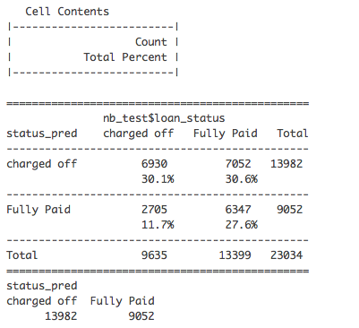

-   [1. Import data and data cleaning](#import-data-and-data-cleaning)
-   [2. Exploratory Data Analysis](#exploratory-data-analysis)
-   [3. Feature selection](#feature-selection)
-   [4. Naive Bayes prediction and
    evaulation](#naive-bayes-prediction-and-evaulation)

  This project creates a statistical model to predict if a customer
will default or fully pay off a loan, and also the probability of being
in each status.   

### 1. Import data and data cleaning

#### 1.1 Load data

    library(readr)
    library(randomForest)
    library(plotly)
    library(e1071)
    library(caret)
    library(ROCR)
    library(dplyr)
    library(descr)
    train = read_csv("C:/Users/yliu/Downloads/train.csv")
    loandata = data.frame(train)

#### 1.2 Check structure of data

    str(loandata)

    ## 'data.frame':    99198 obs. of  21 variables:
    ##  $ id                        : int  1418165 1032352 436240 3255664 8126043 3921481 417536 6534871 498498 12995831 ...
    ##  $ loan_amnt                 : int  17000 30000 12000 12000 8000 20950 8000 5000 3000 15075 ...
    ##  $ emp_length                : chr  "n/a" "6 years" "5 years" "< 1 year" ...
    ##  $ home_ownership            : chr  "MORTGAGE" "MORTGAGE" "MORTGAGE" "MORTGAGE" ...
    ##  $ zip_code                  : chr  "321xx" "950xx" "025xx" "223xx" ...
    ##  $ annual_inc                : num  48000 100000 85000 55000 45000 ...
    ##  $ dti                       : num  21.28 1.19 6.58 7.86 27.13 ...
    ##  $ delinq_2yrs               : int  0 0 0 0 0 0 0 0 0 0 ...
    ##  $ inq_last_6mths            : int  0 0 0 0 1 3 0 0 3 0 ...
    ##  $ open_acc                  : int  8 3 7 6 11 14 8 9 2 6 ...
    ##  $ pub_rec                   : int  0 1 0 0 0 0 0 0 0 0 ...
    ##  $ revol_bal                 : int  10265 8378 0 11253 12856 25144 1150 6666 384 12793 ...
    ##  $ revol_util                : num  76.6 89.1 0 55.4 59.8 78.1 13.9 88.9 96 66.3 ...
    ##  $ total_acc                 : int  15 4 30 15 15 25 17 24 11 18 ...
    ##  $ collections_12_mths_ex_med: int  0 0 0 0 0 0 0 0 0 0 ...
    ##  $ acc_now_delinq            : int  0 0 0 0 0 0 0 0 0 0 ...
    ##  $ tot_coll_amt              : int  NA NA NA 124 0 0 NA 0 NA 0 ...
    ##  $ tot_cur_bal               : int  NA NA NA 146441 49976 197663 NA 160916 NA 67403 ...
    ##  $ total_rev_hi_lim          : int  NA NA NA 20300 21500 32200 NA 7500 NA 19300 ...
    ##  $ purpose                   : chr  "debt_consolidation" "debt_consolidation" "home_improvement" "debt_consolidation" ...
    ##  $ loan_status               : chr  "Fully Paid" "charged off" "Fully Paid" "charged off" ...

    loandata[sapply(loandata, is.character)] = lapply(loandata[sapply(loandata, is.character)], as.factor)

#### 1.3 Summary data

    summary(loandata)

    ##        id             loan_amnt         emp_length     home_ownership 
    ##  Min.   :   54734   Min.   :  700   10+ years:29834   MORTGAGE:47373  
    ##  1st Qu.: 1551173   1st Qu.: 7750   2 years  : 9216   NONE    :   13  
    ##  Median : 7086114   Median :12000   < 1 year : 8364   OTHER   :   49  
    ##  Mean   :13579935   Mean   :13904   3 years  : 7903   OWN     : 8772  
    ##  3rd Qu.:19948050   3rd Qu.:19200   5 years  : 6889   RENT    :42991  
    ##  Max.   :68604659   Max.   :35000   1 year   : 6561                   
    ##                                     (Other)  :30431                   
    ##     zip_code       annual_inc           dti         delinq_2yrs     
    ##  945xx  : 1237   Min.   :   4080   Min.   : 0.00   Min.   : 0.0000  
    ##  112xx  : 1114   1st Qu.:  44000   1st Qu.:11.23   1st Qu.: 0.0000  
    ##  750xx  : 1094   Median :  60000   Median :16.85   Median : 0.0000  
    ##  900xx  :  923   Mean   :  70980   Mean   :17.15   Mean   : 0.2631  
    ##  606xx  :  922   3rd Qu.:  85000   3rd Qu.:22.74   3rd Qu.: 0.0000  
    ##  331xx  :  919   Max.   :8706582   Max.   :39.99   Max.   :21.0000  
    ##  (Other):92989                                                      
    ##  inq_last_6mths      open_acc        pub_rec          revol_bal     
    ##  Min.   :0.0000   Min.   : 0.00   Min.   : 0.0000   Min.   :     0  
    ##  1st Qu.:0.0000   1st Qu.: 8.00   1st Qu.: 0.0000   1st Qu.:  5912  
    ##  Median :1.0000   Median :10.00   Median : 0.0000   Median : 10980  
    ##  Mean   :0.8762   Mean   :11.04   Mean   : 0.1489   Mean   : 15119  
    ##  3rd Qu.:1.0000   3rd Qu.:14.00   3rd Qu.: 0.0000   3rd Qu.: 19073  
    ##  Max.   :8.0000   Max.   :55.00   Max.   :12.0000   Max.   :867528  
    ##                                                                     
    ##    revol_util       total_acc      collections_12_mths_ex_med
    ##  Min.   :  0.00   Min.   :  2.00   Min.   :0.000000          
    ##  1st Qu.: 37.60   1st Qu.: 16.00   1st Qu.:0.000000          
    ##  Median : 57.10   Median : 23.00   Median :0.000000          
    ##  Mean   : 55.43   Mean   : 24.96   Mean   :0.007904          
    ##  3rd Qu.: 75.00   3rd Qu.: 32.00   3rd Qu.:0.000000          
    ##  Max.   :148.00   Max.   :150.00   Max.   :3.000000          
    ##  NA's   :93                        NA's   :13                
    ##  acc_now_delinq     tot_coll_amt      tot_cur_bal      total_rev_hi_lim 
    ##  Min.   :0.00000   Min.   :      0   Min.   :      0   Min.   :      0  
    ##  1st Qu.:0.00000   1st Qu.:      0   1st Qu.:  27784   1st Qu.:  13000  
    ##  Median :0.00000   Median :      0   Median :  72653   Median :  21800  
    ##  Mean   :0.00374   Mean   :    281   Mean   : 131888   Mean   :  28923  
    ##  3rd Qu.:0.00000   3rd Qu.:      0   3rd Qu.: 198254   3rd Qu.:  35800  
    ##  Max.   :5.00000   Max.   :9152545   Max.   :4772549   Max.   :1035000  
    ##                    NA's   :22361     NA's   :22361     NA's   :22361    
    ##                purpose           loan_status   
    ##  debt_consolidation:59006   charged off:38766  
    ##  credit_card       :18992   Fully Paid :60432  
    ##  home_improvement  : 5750                      
    ##  other             : 5616                      
    ##  major_purchase    : 2321                      
    ##  small_business    : 2060                      
    ##  (Other)           : 5453

-   A few quick obeservations:
    -   1.  30% of customers have more than 10 years working experience.

    -   1.  59.5% of customers applied loan for `debt_consolidation`.

    -   1.  `charged off` rate is 40%.

#### 1.4 Check NA's

    sapply(loandata, function(y) sum(length(which(is.na(y)))))

    ##                         id                  loan_amnt 
    ##                          0                          0 
    ##                 emp_length             home_ownership 
    ##                          0                          0 
    ##                   zip_code                 annual_inc 
    ##                          0                          0 
    ##                        dti                delinq_2yrs 
    ##                          0                          0 
    ##             inq_last_6mths                   open_acc 
    ##                          0                          0 
    ##                    pub_rec                  revol_bal 
    ##                          0                          0 
    ##                 revol_util                  total_acc 
    ##                         93                          0 
    ## collections_12_mths_ex_med             acc_now_delinq 
    ##                         13                          0 
    ##               tot_coll_amt                tot_cur_bal 
    ##                      22361                      22361 
    ##           total_rev_hi_lim                    purpose 
    ##                      22361                          0 
    ##                loan_status 
    ##                          0

There are 5 features having missing values.    

### 2. Exploratory Data Analysis

#### 2.1 Annual income

    quantile(loandata$annual_inc, probs = c(0.01, 0.99))

    ##     1%    99% 
    ##  18000 230000

    hist(subset(loandata,18000<annual_inc & annual_inc<230000)$annual_inc,breaks = 50, main = "Annual Income", xlab= "Annual Income")

 Annual income for most people are from 18,000 to 230,000 dollar.
After removing income which are extremely low and high, then we find
distribution is right-skewed and concentrated on the left of the figure.

#### 2.2 Purpose

    purpose_data = data.frame(table(loandata$purpose))
    level = purpose_data[order(-purpose_data$Freq),1]
    purpose_data$Var1 = factor(purpose_data$Var1, levels = level)
    plot_ly(purpose_data, x = ~Var1, y = ~Freq, type = 'bar') %>%
      layout(title = "Loan Purpose",
             xaxis = list(title = "Purpose", tickfont = list(size=9),tickangle = -20,exponentformat = "E"),
             yaxis = list(title = "Count"))

<!--html_preserve-->

<!--/html_preserve-->
  59.5% of curstomers applied loan for `debt_consolidation` and
19.1% applied for `credit_card`.

#### 2.3 Employment length

    emp_data = data.frame(table(loandata$emp_length))
    level = emp_data[order(-emp_data$Freq),1]
    emp_data$Var1 = factor(emp_data$Var1, levels = level)
    plot_ly(emp_data, x = ~Var1, y = ~Freq, type = 'bar') %>%
      layout(title = "Employment Length in Years",
             xaxis = list(title = "Employment Length", tickfont = list(size=9),tickangle = -20,exponentformat = "E"),
             yaxis = list(title = "Count"))

<!--html_preserve-->

<!--/html_preserve-->
`10+ years` group has more than twice customers than other groups.  

### 3. Feature selection

Remove all rows have missing values.

    rf_data = loandata[complete.cases(loandata), ]
    set.seed(123)
    rf_data = rf_data[sample(nrow(rf_data), 15000), ]
    train_ind = sample(seq_len(nrow(rf_data)), size = 10000)
    rf_train = rf_data[train_ind,]
    rf_test = rf_data[-train_ind,]

  Implement random forest to indentify feature importance.

    output.rf = randomForest(loan_status ~ ., data = rf_train[,-5],importance=TRUE)
    output.rf

    ## 
    ## Call:
    ##  randomForest(formula = loan_status ~ ., data = rf_train[, -5],      importance = TRUE) 
    ##                Type of random forest: classification
    ##                      Number of trees: 500
    ## No. of variables tried at each split: 4
    ## 
    ##         OOB estimate of  error rate: 36.53%
    ## Confusion matrix:
    ##             charged off Fully Paid class.error
    ## charged off        1352       2745   0.6700024
    ## Fully Paid          908       4995   0.1538201

    varImpPlot(output.rf,type = 2)

 `dti` is the most important feature, followed by `id`.  `id` is
unique for each cutomer and can be any numbers or symbols.Gernelly, it
should not related to results. For some finance companies offering
loans, when they are in startup stage, in order to develop their
business, they would target their customers in specific area, such as
successful people or white-collar. So it causes the distrimination in
early data. That is the reason `id` will related to results in our case.
But we still need to move this feature.  In graph, some features are
not that related to results, so we choose top 11 features in our
prediction.   

    pre = predict(output.rf,rf_test[,-5] )
    par(mfrow=c(2,2))
    partialPlot(output.rf, rf_test, emp_length)
    partialPlot(output.rf, rf_test, purpose)
    partialPlot(output.rf, rf_test, home_ownership)

    #pred = prediction(as.numeric(pre) , as.numeric(rf_test$status))
    #perf = performance (pred, measure = 'tpr', x.measure = "fpr")
    #plot(perf) + abline(a=0, b=1, col = 'red')

### 4. Naive Bayes prediction and evaulation

#### 4.1 Split data into training and testing set

    feature_select = c("dti", "emp_length", "revol_util", "tot_cur_bal", "loan_amnt", "total_rev_hi_lim", "annual_inc", "revol_bal", "total_acc", "purpose", "inq_last_6mths", "loan_status")
    nb_data = loandata[,feature_select]
    nb_data = nb_data[complete.cases(nb_data), ]
    train_ind = sample(seq_len(nrow(nb_data)), size = nrow(nb_data) *0.7 )
    nb_train = nb_data[train_ind,]
    nb_test = nb_data[-train_ind,]

#### 4.2 Implement Naive Bayes Classifier

    classifier = naiveBayes(loan_status ~ ., nb_train)
    #classifier

#### 4.3 Prediction

    pred = predict(classifier, nb_test, type="raw")

#### 4.4 Evaulation

We have predicted the probabilities of a loan in each status. Next, we
need to decide the threshold for classifying a loan will be charged off
(high risk). In this project let’s define the threshold is 0.6. That
means if the probability of a loan in `Fully Paid` &gt; 0.6, then we
consider it is a good loan.

    status_pred <- ifelse(pred[,"Fully Paid"] > 0.6, "Fully Paid", "charged off")
    crosstab(status_pred, nb_test$loan_status, prop.t = TRUE, plot=FALSE)
    table(status_pred)

    confusionMatrix(status_pred, nb_test$loan_status)

From Confusion Matrix, we see that accuracy is 57.6%.   There are
additional two statistics we also can use to evaluate the results,
Sensitivity and Secificity. Sensitivity is the percentage of positives
that are correctly classified. In our project positive class is
`charged off`. There are 9,635 `charged off` loans we detected 6,930, so
our sensitivity is 71.93%. Secificity is the percentage correctly
identified negatives. The negative is a `Fully Paid` loan. In 13,399
`Fully Paid` loans we correctly identified 7,052 as getting our
specificity 47.37%.  

For some P2P companies offering loans, they have both investors and
borrowers. Higher sensitivity can help investors recude risk. Although
we only define half good customers correctly, we can define 71.93% of
bad (high risk) customers.    

-   Notes and further suggestions:
    -   1.  In our case, we choose 0.6 as threshold. Different
            thresholds have different accuracies. Which cut point we
            should choose depends on our data and goal. Threshold does
            not affect classification or probabilities.

    -   1.  We only got 60% accuracy in our prediction for Naive Bayes
            and 63% for Random Forest. We can add more information to
            improve our results, such as credit score (FICO) or score
            grade.
