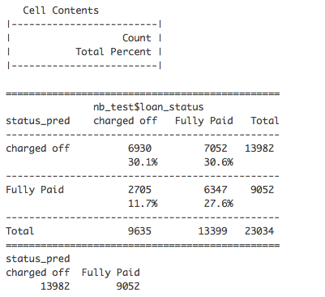
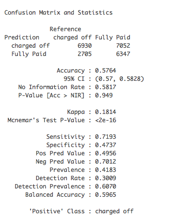

<br/>
This project creates a statistical model to predict if a customer will default or fully pay off a loan, and also the probability of being in each status.
<br/><br/>

### 1. Import data and data cleaning
#### 1.1 Load data
```{r, message=FALSE, warning=FALSE}
library(readr)
library(randomForest)
library(plotly)
library(e1071)
library(caret)
library(ROCR)
library(dplyr)
library(descr)
train = read_csv("~/Downloads/Data_challenge/train.csv")
loandata = data.frame(train)
```
#### 1.2 Check structure of data
```{r, message=FALSE, warning=FALSE}
str(loandata)
loandata[sapply(loandata, is.character)] = lapply(loandata[sapply(loandata, is.character)], as.factor)
```
#### 1.3 Summary data
```{r, message=FALSE,warning=FALSE}
summary(loandata)
```

* A few quick obeservations:
    + 1. 30% of customers have more than 10 years working experience.
    + 2. 59.5% of customers applied loan for `debt_consolidation`.
    + 3. `charged off` rate is 40%.
   
#### 1.4 Check NA's
```{r, message=FALSE,warning=FALSE}
sapply(loandata, function(y) sum(length(which(is.na(y)))))
```
There are 5 features having missing values.
<br/> <br/>


### 2. Exploratory Data Analysis
#### 2.1 Annual income
```{r,warning=FALSE,message=FALSE}
quantile(loandata$annual_inc, probs = c(0.01, 0.99))
hist(subset(loandata,18000<annual_inc & annual_inc<230000)$annual_inc,breaks = 50, main = "Annual Income", xlab= "Annual Income")
```
<br/>Annual income for most people are from 18,000 to 230,000 dollar. After removing income which are extremely low and high, then we find distribution is right-skewed and concentrated on the left of the figure.   

#### 2.2 Purpose
```{r, message=FALSE, warning=FALSE}
purpose_data = data.frame(table(loandata$purpose))
level = purpose_data[order(-purpose_data$Freq),1]
purpose_data$Var1 = factor(purpose_data$Var1, levels = level)
plot_ly(purpose_data, x = ~Var1, y = ~Freq, type = 'bar') %>%
  layout(title = "Loan Purpose",
         xaxis = list(title = "Purpose", tickfont = list(size=9),tickangle = -20,exponentformat = "E"),
         yaxis = list(title = "Count"))

```

<br/> 59.5% of curstomers applied loan for `debt_consolidation` and 19.1% applied for `credit_card`.    

#### 2.3 Employment length
```{r,message=FALSE,warning=FALSE}
emp_data = data.frame(table(loandata$emp_length))
level = emp_data[order(-emp_data$Freq),1]
emp_data$Var1 = factor(emp_data$Var1, levels = level)
plot_ly(emp_data, x = ~Var1, y = ~Freq, type = 'bar') %>%
  layout(title = "Employment Length in Years",
         xaxis = list(title = "Employment Length", tickfont = list(size=9),tickangle = -20,exponentformat = "E"),
         yaxis = list(title = "Count"))

```

`10+ years` group has more than twice customers than other groups.
<br/>

### 3. Feature selection
Remove all rows have missing values.
```{r, message=FALSE, warning=FALSE}
rf_data = loandata[complete.cases(loandata), ]
set.seed(123)
rf_data = rf_data[sample(nrow(rf_data), 15000), ]
train_ind = sample(seq_len(nrow(rf_data)), size = 10000)
rf_train = rf_data[train_ind,]
rf_test = rf_data[-train_ind,]
```

<br/>
Implement random forest to indentify feature importance.
```{r, message=FALSE, warning=FALSE}
output.rf = randomForest(loan_status ~ ., data = rf_train[,-5],importance=TRUE)
output.rf
varImpPlot(output.rf,type = 2)
```
<br/>`dti` is the most important feature, followed by `id`.<br/>
`id` is unique for each cutomer and can be any numbers or symbols.Gernelly, it should not related to results. For some finance companies offering loans, when they are in startup stage, in order to develop their business, they would target their customers in specific area, such as successful people or white-collar. So it causes the distrimination in early data. That is the reason `id` will related to results in our case. But we still need to move this feature.<br/>
In graph, some features are not that related to results, so we choose top 11 features in our prediction.
<br/><br/>
```{r}
pre = predict(output.rf,rf_test[,-5] )
par(mfrow=c(2,2))
partialPlot(output.rf, rf_test, emp_length)
partialPlot(output.rf, rf_test, purpose)
partialPlot(output.rf, rf_test, home_ownership)


#pred = prediction(as.numeric(pre) , as.numeric(rf_test$status))
#perf = performance (pred, measure = 'tpr', x.measure = "fpr")
#plot(perf) + abline(a=0, b=1, col = 'red')
```

### 4. Naive Bayes prediction and evaulation
#### 4.1 Split data into training and testing set
```{r,message=FALSE,warning=FALSE}
feature_select = c("dti", "emp_length", "revol_util", "tot_cur_bal", "loan_amnt", "total_rev_hi_lim", "annual_inc", "revol_bal", "total_acc", "purpose", "inq_last_6mths", "loan_status")
nb_data = loandata[,feature_select]
nb_data = nb_data[complete.cases(nb_data), ]
train_ind = sample(seq_len(nrow(nb_data)), size = nrow(nb_data) *0.7 )
nb_train = nb_data[train_ind,]
nb_test = nb_data[-train_ind,]
```
#### 4.2 Implement Naive Bayes Classifier
```{r,message=FALSE,warning=FALSE}
classifier = naiveBayes(loan_status ~ ., nb_train)
#classifier
```

#### 4.3 Prediction
```{r, message=FALSE,warning=FALSE}
pred = predict(classifier, nb_test, type="raw")
```
#### 4.4 Evaulation
We have predicted the probabilities of a loan in each status. Next, we need to decide the threshold for classifying a loan will be charged off (high risk). In this project let’s define the threshold is 0.6. That means if the probability of a loan in `Fully Paid` > 0.6, then we consider it is a good loan.
```{r,message=FALSE,warning=FALSE, eval=FALSE}
status_pred <- ifelse(pred[,"Fully Paid"] > 0.6, "Fully Paid", "charged off")
crosstab(status_pred, nb_test$loan_status, prop.t = TRUE, plot=FALSE)
table(status_pred)
```

```{r, message=FALSE, warning=FALSE, eval=FALSE}
confusionMatrix(status_pred, nb_test$loan_status)
```




From Confusion Matrix, we see that accuracy is 57.6%. <br/>
There are additional two statistics we also can use to evaluate the results, Sensitivity and Secificity. Sensitivity is the percentage of positives that are correctly classified. In our project positive class is `charged off`. There are 9,635 `charged off` loans we detected 6,930, so our sensitivity is 71.93%. Secificity is the percentage correctly identified negatives. The negative is a `Fully Paid` loan. In 13,399 `Fully Paid` loans we correctly identified 7,052 as getting our specificity 47.37%. <br/>

For some P2P companies offering loans, they have both investors and borrowers. Higher sensitivity can help investors recude risk. Although we only define half good customers correctly, we can define 71.93% of bad (high risk) customers.
<br/> <br/>

* Notes and further suggestions:
    + 1. In our case, we choose 0.6 as threshold. Different thresholds have different accuracies. Which cut point we should choose depends on our data and goal. Threshold does not affect classification or probabilities.
    + 2. We only got 60% accuracy in our prediction for Naive Bayes and 63% for Random Forest. We can add more information to improve our results, such as credit score (FICO) or score grade.


### 5. Code for test.csv and submission_file.csv
#### 5.1 Prediction in test.csv 
```{r,message=FALSE,warning=FALSE,eval=FALSE}
test = read_csv("~/Downloads/Data_challenge/test.csv")
test[sapply(test, is.character)] = lapply(test[sapply(test, is.character)], as.factor)
pred_test = predict(classifier, test, type="raw")
pred_test = data.frame(cbind(test$id, pred_test))
names(pred_test)[1] = "id"
```

#### 5.2 Merge test.csv and submission_file.csv
```{r,message=FALSE,warning=FALSE,eval=FALSE}
submission_file = read_csv("~/Downloads/Data_challenge/submission_file.csv")
submission_file = merge(submission_file, pred_test, by.x = "id", by.y = "id",all.x=TRUE, sort=FALSE)
write.csv(submission_file, "~/Downloads/Data_challenge/submission_file2.csv",row.names = FALSE)
```

